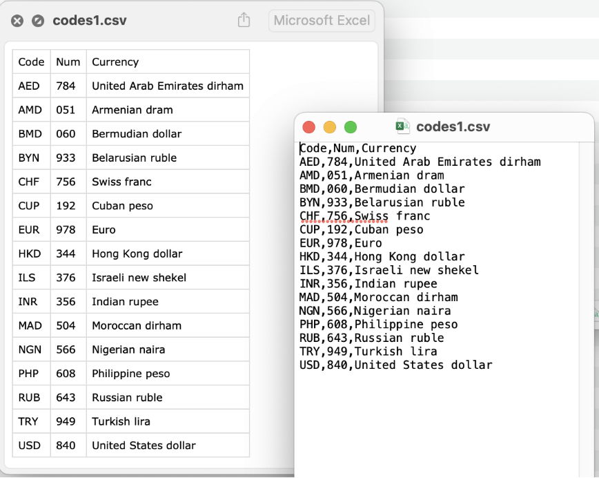

# Режимы открытия файлов. Работа с форматами csv, json, xml, yaml

## Функция open() для чтения и записи файлов

Скрипт, который пишет программист, чаще всего взаимодействует с операционной системой и файлами, которые в ней находятся. Поэтому файлы и данные, которые они содержат, очень полезны. В зависимости от расширения файла, интерпретатор Python может взаимодействовать с ним по разному с учетом выбранного режима.

**Файл — это упорядоченная совокупность байтов, которая хранится на диске.** Его можно открыть для чтения и прочитать в память содержимое. Функция `open()` считывает файл как объект.

**Режим чтения**

Вместе с функцией `open()` необходимо указать:

* Путь до указанного файла `"yesterday.txt"` в виде строки.
* Параметр `r` — чтение в текстовом режиме.
* Метод `read()` — получить содержимое файла.
* Метод `close()` — закрыть файла, чтобы очистить буфер.

Скачать файл "yesterday.txt" [можно по ссылке](files/yesterday.txt).

```Python
file = open('yesterday.txt', mode='r')
file_content = file.read()
file.close()
print(file_content)
```

**Бинарное чтение**

В результате открытия файла в режиме бинарного чтения в выводе можно увидеть все управляющие символы, например перенос строки `\n`. Параметр `rb` — бинарное чтение

```Python
## открытие файлов с ASCII2
file = open('yesterday.txt', mode='rb')
file_content = file.read()
file.close()
print(file_content)
```

Однако если открыть в бинарном режиме файл, содержащий кириллицу, то при выводе на экран получится набор шестнадцатеричных кодов. Символы, входящие в ASCII2, отображаются так как есть.

Скачать файл "borodino.txt" [можно по ссылке](files/borodino.txt).

```Python
## открытие файлов с кириллицей
file = open('borodino.txt', mode='rb')
file_content = file.read()
file.close()
print(file_content)
```

**Запись содержимого**

Режим записи `w` позволяет сохранять содержимое буфера в новый файл. Если в текущем каталоге уже есть файл с тем же именем, то **при открытие в режиме `w` содержимое существующего файла стирается.** Учитывайте, что имя файла может быть с путем по файловой системе. Если путь не указан — то ищется в рабочей директории скрипта. Если файл не найден, возникает исключение `FileNotFoundError`.

```Python
file = open('out.txt', mode='w')
file_content = 'hello world!'
file.write(file_content)
file.c
```

Также существует запись в бинарном режиме — `wb`

```Python
file = open('out.txt', mode='wb')
file_content = b'hello'
file.write(file_content)
file.close()
```

**Другие режимы открытия файлов**

В существующие файлы можно добавлять строки, используя режим `а`. При этом информация добавляется в конец файла. Для открытого объекта файла можно вызывать метод файла для записи.

```Python
file = open('out.txt', mode='a') 
file_content = 'How are you? '
file.write(file_content)
file.close()
```

Для того, чтобы прочитать и добавить в файл, можно использовать режим чтения с записью `r+`.

```Python
file = open('yesterday.txt', mode='r+') 
file_content = file.read()
file.write('\nBeatles!')
file.close()
pprint(file_content)
```

Наоборот, записать и прочесть файл, можно с помощью режима `w+`.

```Python
file = open('out.txt', mode='w+')
file_content = file.read()
file.write('Next Song – Yellow Submarine')
file.close()
pprint(file_content)
```

## Оператор with

**Как в потоке программы можно открыть файл?** Для этого используют несколько форм работы с файлами.

**Вариант №1. Чтение построчно**

Файл можно прочитать построчно с помощью цикла, перебрав объект. Чтение происходить из буфера по одной строчке. Если буфер переполнен то, следующий кусочек файла считывается с диска. Выгодно, если файл большого объема.

```Python
file = open('yesterday.txt', mode='r', encoding='utf8')
for line in file:
    print(line)
file.close()
```

**Вариант №2. С помощью readlines**

Метод `readlines()` представляет каждую строку, как элемент списка. В результате доступность к строкам растет. Однако, если файл объемный, то весь объект документа сразу выгрузится в память. Это не производительно! Желательно использовать только для небольших файлов.

```Python
file = open('yesterday.txt', mode='r', 
encoding='utf8')
for line in file.readlines():
print(line)
file.close()
```

**Вариант №3. Применение цикла while**

Каждую строчку можно проверить на условие. Читаем построчно, до тех пор пока не выполнится условие. Чтобы не читать файл полностью, можно воспользоваться оператором `break`.

```Python
file = open('yesterday.txt', mode='r', encoding='utf8')
line = True
while line:
    line = file.readline()

    if 'easy game' in line:
        print('Good Game, Well Played')
        break
    else:
        print('There is no game to play!')

file.close()
```

!!! info "Зачем закрывать файлы file.close()?"

    Обратите внимание, что в каждом из способов надо следить, чтобы файл был закрыт. Иначе при работе с большим количеством незакрытых файлов операционная система может отказать в открытии новых файлов.

**Вариант №4. Оператор with**

Чтобы упросить работу с проверкой открытия файла, лучше использовать оператор `with`. C помощью него файл закроется автоматически. Если внутри блока кода возникает ошибка, то оператор `with` закроет файл. Оператор `with` также используется, когда нужно закрыть соединение с внешними ресурсами.

```Python
with open('yesterday.txt', mode='r', encoding='utf8') as file:
    for line in file:
        print(line)
    
print('файл закрыт?:', file.closed)
```

## Хранение данных

Компьютер использует данные разного формата для решения разного рода задач. Обычно разнообразие форматов связано с отличием программных интерфейсов и структурой самих данных. Существуют стандарты, которые утверждают универсальные способы хранения данных конкретной структуры. Например, в формате `json` хранят сложные структуры данных, а формат `xml` используется для обмена данными между компьютером и приложением.

## Формат CSV

Существует много данных, которые представлены в табличном виде. Нам известно множество форматов для электронных таблиц и соответствующих редакторов. Однако универсальным табличным форматом является `csv`. Термин _"comma-separated value"_ и аббревиатура _"CSV"_ появился в 1983 году. Тогда еще в _IBM PC_ использовались подобного рода конструкции.



Файл `csv` удовлетворяет следующим требованиям:

* строки делятся переносом строки,
* ячейки делятся запятыми или точкой с запятой,
* если ячейка содержит запятую или перенос строки, ячейка обрамляется кавычками,
* если внутри системных кавычек есть кавычки, они пишутся в виде двойных кавычек.

=== "Как записать таблицу"
    Инфо,x,y<br>
    'квартал 1',1,2<br>
    'квартал 2',2,4<br>
    'квартал 3',3,6<br>
    'квартал 4',4,8<br>
    ,,Итого

=== "Как выглядит таблица"
    Инфо | x | y
    :--|:--|:--
    квартал 1|1|2
    квартал 2|2|4
    квартал 3|3|6
    квартал 4|4|8
    ||Итого

### Операции с CSV-файлами

Для работы методов csv необходимо импортировать встроенную библиотеку csv

```Python
import csv
```

**Чтение csv файла**

Функция `reader()` создаст объект, из которого можно построчно извлечь всю информацию из таблицы в виде списка списков. Рассмотрим табличный файл _codes.csv_, который содержит информацию о валютах и расшифровках.

Скачать файл можно [по ссылке](files/codes.csv).

```Python
currencies = []

with open('codes.csv', 'r') as csv_file:
    csv_data = csv.reader(csv_file)
    for row in csv_data:
        currencies.append(row)

print(f'Вся информация о таблице: {currencies}')
```

**Запись csv файла**

Функция `writer()` позволяет записывать файл или добавлять в него. В данном примере добавляем строку в виде списка. Для создания новой строки в файле _codes.csv_ необходимо использовать параметр функции open – `newline`.

```Python
new_currency = ['GBP', '826', 'Pound sterling']

with open('codes.csv', 'a', newline='') as out_csv:
    writer = csv.writer(out_csv)
    writer.writerow(new_currency)
```

**Запись в csv из списка списков**

Процесс работы с табличными данным похож в Python на работу со списками.
И если мы очень захотим, мы сможем создать файл `csv` с помощью списка из списков.

```Python
my_favorite_songs = [
    ['Song name', 'Duration'],
    ['Waste a Moment', 3.03],
    ['New Salvation', 4.02],
    ['Staying\' Alive', 3.40],
    ['Out of Touch', 3.03],
    ['A Sorta Fairytale', 5.28],
    ['Easy', 4.15],
    ['Beautiful Day', 4.04],
]

with open('out.csv', 'w', newline='') as out_csv:
    writer = csv.writer(out_csv)
    writer.writerows(my_favorite_songs)
```

**DictReader. Колонка, как словарь**

Объект `DictReader` позволяет использовать особенности словарей Python.
Зачастую нам не нужна вся таблица, а только определенная часть информации из неё. По этой причине, **словари позволяют получить доступ к столбцам таблиц по их заголовкам**. Аргумент `delimeter` указывает на символ-разделитель между ячейками.

```Python
codes = []

with open('codes.csv', 'r') as csvfile:
    reader = csv.DictReader(csvfile, delimiter=',')

    for row in reader:
        currency_code = row['Code']
        codes.append(currency_code)

print(f'Список валют: {codes}')
```

**Запись через DictWriter**

`DictWriter` выполняет запись в файл, но уже при помощи словарей Python.

```Python
f_names = ('Code', 'Num', 'Currency')
new_currency = {'Code': 'RSD','Num': '941' ,'Currency': 'Serbian dinar'}

with open('codes.csv', 'a', newline='') as out_file:
    writer = csv.DictWriter(out_file, delimiter=',', fieldnames=f_names)
    writer.writerow(new_currency)
```

Что же будет, если ключи словаря на запись будут отличны от ключей, заданных аргументом `fieldnames`? В этом случается Python выдает ошибку `ValueError` с перечнем ключей, в которых была ошибка.

```Python
wrong_currency = {'code': 'RSD','num': '941' ,'currency': 'Serbian dinar'}

with open('codes.csv', 'a', newline='') as out_file:
    writer = csv.DictWriter(out_file, delimiter=',', fieldnames=f_names)
    writer.writerow(wrong_currency)
```

??? info "Как определить delimeter в неизвестном файле csv?"

    Существуют параметры, связанные непосредственно с чтением и записью CSV-файлов. Так, в примерах выше, мы явно указывали тип разделителя для полей (`delimiter=','`) Подобные параметры, определяют правила, по которым будет считана или записана информация CSV файла. Чтобы не настраивать каждый раз все параметры вручную, они были сгруппированы в объекты dialects.

    Если вы не знаете, какие параметры диалекта использовались в файле, то необходимо воспользоваться объектом `csv.Sniffer()`. Метод `sniff()` позволяет по примеру строки восстановить параметры используемого диалекта.
    Передав найденные параметры класс `reader`, мы с его помощью сможем корректно прочесть информацию из файла. Указание кодировки _utf-8_ позволяет избежать конфликтов с некорректной интерпретацией строк внутри кавычек.

    Скачайте файл codes_oth.csv [по ссылке]().

    ```Python
    import csv

    print(f'По умолчанию доступны следующие диалекты {csv.list_dialects()}’)

    with open('codes_oth.csv', 'r', encoding='utf-8') as csvfile:
        dialect = csv.Sniffer().sniff(str(csvfile.readline()), [',', ';'])
        csvfile.seek(0)
        reader = csv.reader(csvfile, dialect)
        print(dialect)
        print(reader)
    ```

??? info "Позиционирование в файле"

    Файл можно представить как ленту на шоколадной фабрике, только вместо конфет – байты. Лента имеет начало и конец, каждая конфета пронумерована. Мы можем ходить вдоль ленты - брать или класть конфеты. Если файл открыт только для чтения (посмотреть на конфеты) – то при открытии файла стоим вначале ленты, на 0 месте. А при самом чтении - сдвигаемся вдоль ленты на количество прочитанных конфет.

    ```Python    
    ## Текущая позиция в файле file.tell()
    file = open('yesterday.txt', mode='r', encoding='utf8')
    print(file.tell())

    ## курсор чтения находится в начале 
    print('читаем 100 символов')

    ## прочитать 100 символов
    file_content = file.read(100)
    print(file_content)

    ## 100. Это значение в байтах!
    print(file.tell())
    ```

    Значение при перемещении по файлу, символы которого записаны кириллицей, будет больше, так как файл каждый кириллический символ занимает 2 байта.

    ```Python
    file = open('borodino.txt', mode='r', encoding='utf8')
    # прочитать 100 символов
    file_content = file.read(100)
    print(file.tell()) # 180
    ```

    Позицию для чтения можно менять с помощью `file.seek()`

    * `io.SEEK_SET` - начало файла
    * `io.SEEK_CUR` - текущая позиция
    * `io.SEEK_END` - конец файла
    
    Зададим поиск от начала того же файла. Параметр 0 означает количество байт, на которое нужно сдвинуться от указанной позиции. При введение некорректного количества байт получим ошибку `UnicodeDecodeError`.

    ```Python
    import io # для работы вводом-выводом

    ## прочитаем до 100 символа файл borodino.txt
    file = open('borodino.txt', mode='r', encoding='utf8')
    file_content = file.read(100)
    print(file_content)

    ## вернемся в начало файла
    new_position = file.seek(0, io.SEEK_SET)
    ```

### Применение CSV формата

Формат csv популярен в [Data Science](https://ru.wikipedia.org/wiki/%D0%9D%D0%B0%D1%83%D0%BA%D0%B0_%D0%BE_%D0%B4%D0%B0%D0%BD%D0%BD%D1%8B%D1%85), так как в нём можно хранить большое количество упорядоченных данных. В `csv` формате также можно делать экспорт из реляционных баз данных. Также на практике активно используется пакет `pandas` для расширенной работы с табличными данными.

```Python
streets_of_houses = []

with open('houses.csv', 'r') as csvfile:
    reader = csv.DictReader(csvfile, delimiter=',')
    for row in reader:
        house_street = row['Street']
        streets_of_houses.append(house_street)

print(f'Cписок улиц домов: {set(streets_of_houses)}')
```

## Формат JSON

Формат `JSON` _(или JavaScript Object Notation)_ был создан в `JavaScript`, но несмотря на это он является полностью независимым и универсальным. Как правило любой современный язык программирования поддерживает этот формат в той или иной форме, что позволяет использовать `JSON` для обмена данными.

=== "Как записать json"

    ```JSON
    {
        "FirstName": "Dominick",
        "LastName": "Cobb",
        "Address": {
            "city": "Los Angeles",
            "StreetAddress": "S Olive st 617"
        },
        "ContactDetails": {
            "PhoneNumbers": ["+1 212-626-8118", "+1 212-484-4554"],
            "E-mail": "inception@nolan.genii"
        }
    }
    ```

=== "Как выглядит json в браузере"

    ```JSON	
    FirstName:          "Dominick"
    LastName:           "Cobb"
    Address:
        city:           "Los Angeles"
        StreetAddress:  "S Olive st 617"
    ContactDetails:
        PhoneNumbers:
            0:          "+1 212-626-8118"
            1:          "+1 212-484-4554"
        E-mail:         "inception@nolan.genii"
    ```

Если формат `CSV` удобен для хранения двумерных массивов данных, то `JSON` удобнее использовать для хранения сложных структур данных.

Создавать сложные иерархии позволяет тот факт, что в роли "значения", могут выступать:

* `object` (аналог словаря dict)
* `array` (аналог списка - list)
* `string` (str)
* `number` (int, float)
* `true/false` (True/False)
* `null` (None)

Используя `object`, можно добавлять уровни вложенности.

### Операции с JSON-файлами

**Запись json в словаре**

**Структуру `JSON` в Python можно представить в виде словаря.** Это позволяет фиксировать многоуровневую вложенность и проводить запись в формат `JSON` и загрузку из него.

```Python
data = {
   "FirstName": "Dominick",
   "LastName": "Cobb",
   "Adress": {
       "city": "Los Angeles",
       "StreetAdress": "S Olive st 617",
   },
   "ContactDetails": {
       "PhoneNumbers": ["+1 212-626-8118", "+1 212-484-4554"],
       "E-mail": "inception@nolan.genii",
   }
}
```

**Сериализация**

Процесс сериализации означает трансформацию данных в байты, то есть в структурированный формат данных, который может быть прочитан и изменен любой другой программой. **По сути мы говорим о привычной записи в файл**.

Для сериализации используют несколько функций. Функция `dump()` — запись в файл.

```Python
with open("Dom.json", "w") as write_file:
    json.dump(data, write_file)
```

Функция `dumps()` — запись в переменную.

```Python
json_data = json.dumps(data)
```

Таким образом полученный словарь будет преобразован в формат JSON в виде строки

```Python
print(json_data)
```

Функция `dumps()` имеет несколько интересных параметров. Параметр `indent` отвечает за отступы.

```Python
json_data_with_indent = json.dumps(data, indent=4)

print(f'Cтрока с отступами: {json_data_with_indent}')
with open("Dom#2.json", "w") as file:
    file.write(json_data)
```

Параметр `sort_keys` позволяет отсортировать словарь по именам ключей, что в некоторых случаях тоже бывает полезно.

```Python
json_data_sorted = json.dumps(data, indent=4, sort_keys=True)
print(f'В результате ключи будут отсортированы: {json_data_sorted}')
```

**Десериализация**

Процесс десериализации `JSON` — это обратный процесс сериализации, то есть преобразование данных из формата JSON в объекты pyhton (декодирование данных). Также, можно считать, что **десериализациия — это процесс чтения их файла**.

Для чтения из json-файла используется функция `load()`.

```Python
with open("Dom#2.json", "r") as read_file:
    loaded_json_file = json.load(read_file)

print(loaded_json_file)
```

В итоге строка, которую мы загрузили в файл _Dom#2_, превратилась обратно в словарь.

Аналогично словарю, можно получить доступ к нужному полю.

```Python
print(loaded_json_file["FirstName"])
print(loaded_json_file["Address"]["city"])
```

Чтобы прочитать json-строку из переменной используется функция `loads()`. Строка превращается обратно в словарь.

```Python
loaded_json_str = json.loads(json_data)
print(f': {loaded_json_str}')
```

## Другие форматы обмена данными

### Формат XML

Помимо `JSON` существует ещё несколько форматов для обмена данными. Один из них `XML` _(eXtensible Markup Language, «расширенный язык разметки»)_. **Формат `XML` представляет собой данные, обрамленные тегом, состоящим из открывающих и закрывающих элементов.** Такое объединение само по себе способно быть представленным в поле данных, что позволяет нам строить иерархию.

Пример xml-файла

```XML
<data>
 <name>Petya</name>
 <age>23</age>
 <sex>true</sex>
 <languages>
  <language name="Python">9</language>
  <language name="Java">7</language>
  <language name="C#">8</language>
  <language1 name="C#">8</language1>
 </languages>
  <pc>
    <pc_item name="os">Linux</pc_item>
    <pc_item name="proc">Intel Core i7-8700</pc_item>
    <pc_item name="ram">64</pc_item>
    <pc_item name="hard">5000</pc_item>
  </pc>
</data>
```

### Операции с XML

С сайта нам поступают резюме кандидатов в формате `xml`. Необходимо разбить на части _(распарсить)_ имеющийся документ с помощью метода `parse()`.

Скачайте файл [по ссылке](files/demo.xml).

```Python
import xml.etree.ElementTree as ETree

developers_cv = ETree.parse('demo.xml') # распарсим
root_of_developers_cv = developers_cv.getroot() # корень дерева

print(root_of_developers_cv.tag) # название корневого тэга
print(root_of_developers_cv.text) # текста в нём нет

print(root_of_developers_cv[0].tag) # следующий элемент, название тэга, 
print(root_of_developers_cv[0].text) # текст внутри
```

Вытащим информацию о языках программирования, перебрав корень дерева

```Python
skills = []

for langs in root_of_developers_cv[3]:
    skills.append(langs.attrib['name'])

print(f'В резюме указаны следующие ЯП: {skills}')
```

### Формат YAML

Ещё один из схожих форматов — `YAML`. Сперва он носил название: _Yet Another Markup Language_ и позиционировался как конкурент `XML`. Однако позже название изменили на _YAML Ain't Markup Language_. Так создатели пытались сказать, что они меньше внимания уделяют разметке, а больше самим данным, что и отражается в его структуре, читать которую можно интуитивно.

Пример yaml-файла

```YAML
Developers:
 martin:
   name: Martin D'vloper
   job: Developer
   skills:
     - python
     - perl
     - pascal
 tabitha:
   name: Tabitha Bitumen
   job: Developer
   skills:
     - lisp
     - fortran
     - erlang
     - 
```

### Операции с YAML

Пакет `yaml` является внешним, поэтому его необходимо сначала установить.

```bash
pip install pyyaml
```

Теперь мы получили резюме в формате `yaml`. Полученное резюме превратим в словарь с помощью функции `load()`, предварительно прочитав файл.

Скачайте файл с резюме [по ссылке](files/yaml_example.yaml).

```Python
import yaml

with open("yaml_example.yaml", "r") as yaml_file:
    martins_resume_in = yaml.load(yaml_file, Loader=yaml.FullLoader)

print(martins_resume_in)  # <class 'dict'>
```

Обратная операция восстановила структуру, превратив словарь в строку через функцию `dump()`, соответствующую формату yaml.

```Python
martins_resume_out = yaml.dump(martins_resume_in)
print(martins_resume_out)  # <class 'str'>
```

## Промежуточные итоги

* Файл является объектом в Python и представлен как поток байтов.
* Файлы необходимо закрывать. Поэтому удобно использовать оператор with.
* Приложению передают данные между собой с помощью форматов csv, json, xml, yaml.
* Формат csv является табличной структурой, где данные можно выгрузить/записать в виде строк или в виде словарей, где ключ – это название колонки.
* Формат json хранит сложные структуры данных и представлены в Python в виде словарей.
* Формат xml и yaml имеют древовидную структуру и используются для передачи между приложениями и удобным форматом для чтения разработчиком.
