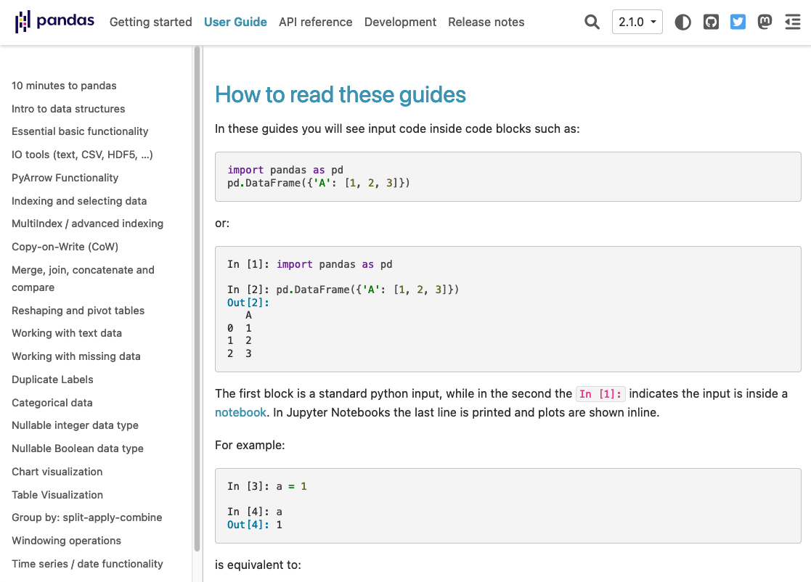

# Внешние пакеты. Пакеты pandas, python-docx

!!! tip inline end "Пример пакета Pandas"

    [](https://pandas.pydata.org/docs/user_guide/index.html)

## Site-Packages

Кроме встроенных модулей Python, существуют модули и пакеты, которые пишут другие разработчики. Такие пакеты, как `flask`, `django`, `pandas`, `aiogram`, `dash`, и многие другие, активно применяются на практике. Часто, использование таких пакетов подразумевает дополнительное изучение документации из-за объема возможностей. Разные отрасли, также, добавляют свою специфику при использовании.

## Установка пакета с помощью pip

Для того, чтобы установить пакет из сети в Python используют пакетные менеджеры. **Встроенным пакетным менеджером является `pip`**. Для того, чтобы им воспользоваться нужно использовать оболочку.

* Для `Windows` — это `PowerShell`.
* Для `MacOS` — это `Terminal`.
* Для `Linux` — это `Console`.

Для установки пакета pandas введите команду:

```bash
pip install pandas
```

## Примеры внещних пакетов

### Пакет pandas для создания таблиц

**`Pandas` – это пакет для обработки табличных данных**. Его часто применяют для предобработки массивов данных в Data Science. Для того, чтобы создать таблицу, воспользуемся основным объектом pandas — `DataFrame`. Поместим в нее словарь, значения которого являются списками. `DataFrame` имеет множество методов для редактирования. [Подробнее по ссылке](https://pandas.pydata.org/docs/getting_started/intro_tutorials/01_table_oriented.html).

```Python
import pandas

## объект DataFrame - создает двумерный массив
## cоздадим DataFrame из словаря
df = pandas.DataFrame({
    'x': [1, 2, 3, 4],
    'y': [2, 4, 6, 8],
    })

print(df) # вывести на экран
print(df.shape) # посмотреть размер таблицы
print(df['x']) # показать колонку

## сохранить в csv
print(df.to_csv('table.csv', index=False))
```

### Пакет python-docx для создания документами

Модуль python-docs используется для анализа документов в формате `docx`. Для того, чтобы установить этот пакет зайдите в оболочку и введите команду:

```bash 
pip install python-docx
```

Скачайте файл [docx_example.docx по ссылке](files/docx_example.docx). Импортируется объект `Document`, который принимает файл в качестве параметра. Далее созданный объект использует методы, как параметры форматирования `docx`. О пакете docx [подробнее по ссылке](https://python-docx.readthedocs.io/en/latest/).

```Python
import docx
doc = docx.Document('docx_example.docx')

## Свойства документа
properties = doc.core_properties
print('Автор последней правки:', properties.last_modified_by)

## Работа с абзацами документа
text = []
for paragraph in doc.paragraphs:
    text.append(paragraph.text)
print('\n'.join(text))
```

## Промежуточные итоги

* Кроме встроенных модулей, многие разработчики создают собственные модули, которые предложить эффективное решение прикладных задач.
