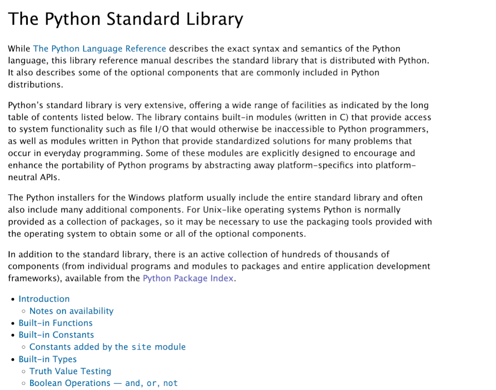

# Стандартная библиотека Python. Модули pprint, sys, decimal

## Внутренние и внешние пакеты

Одним из достоинств Python является то, что для решения разного рода задач, скорее всего, существует уже готовый модуль или пакет. Программисту не нужно заново писать код и, в таком случае, он может воспользоваться уже готовым решением. Вместе с Python устанавливается и стандартная библиотека Python. Другие пакеты, не входящие в нее, можно установить отдельно.

Встроенные модули устанавливаются вместе с Python в виде **стандартной библиотекой** (Python standard library). Их можно использовать без дополнительных условий. Со стандартной библиотекой Python можно ознакомиться [по ссылке](https://docs.python.org/3/library/index.html).

!!! tip inline end "Python standard library"

    [](https://docs.python.org/3/library/index.html)

Примеры некоторых модулей библиотеки:

* `sys` – взаимодействие с интерпретатором
* `decimal` – дробные числа повышенной точности
* `random` – генерация случайных чисел
* `time` и `datetime` – работа с датой и временем
* `re` – поиск с помощью регулярных выражений
* И другие.

## Импорт встроенной функции pprint

В том случае, если мы пытаемся импортировать имя из встроенного пакета, то предварительно не нужно его устанавливать. Вы имеете доступ к ним из любого модуля Python. Модуль `pprint` содержит функцию `pprint`, которая позволяет красиво отображать длинные списки и словари. При этом сохраняется структура объекта и отображение, которое выводит `pprint`, можно использовать для создания объекта.

```Python
## функция pprint для красивого вывода длинных списков и словарей
from pprint import pprint

pprint(dir(__builtins__))
```

## Модуль sys и stdin

Модуль `sys` необходим для регулирования работы интерпретатора Python, например, для контроля словарей имен переменных. Функция `stdin` используется для интерактивного ввода с консоли, включая вызовы `input()`. В случае запуска функции `stdin` вы можете вводить данные в консоль.

```Python
## для ввода с консоли
from sys import stdin

lines = []
for line in stdin:
    lines.append(line)

print(lines)
```

!!! danger "Как прервать исполнение кода?"

    Чтобы завершить ввод, нажмите сочетание клавиш `Ctrl + Z`(`D` для Mac), затем `Enter`. Данная комбинация запустит `End of line` и завершит код.

## Модуль decimal

### Решение проблемы потери точности

Как известно, числа с плавающей точкой (`float`) имеют точность хранения в памяти – 8 или 16 байт. Но даже в этом объеме не получается учесть все вариации десятичных дробей. Поэтому возникает проблема потери точности.

```Python
4.31 == 4.3099999999999996  # True
```

В таком случае, **для контроля точности можно использовать тип данных `Decimal`** — в нем можно контролировать нужную точность и способы округления.

Рассмотрим пример сложения в случае с `float`.

```Python
print(0.3 + 0.3 + 0.3 + 0.1)
```

В случае с `Decimal`,

```Python
from decimal import Decimal, getcontext

print(Decimal('0.3') + Decimal('0.3') + Decimal('0.3') + Decimal('0.1'))
```

`Decimal` хранит заданное количество знаков после запятой, которое можно настроить.

```Python
getcontext().prec = 50
```

### Задача №1. Точность подсчетов

**Условие задачи**

Внимательно прочтите условие задачи и скопируйте в среду разработки.

```Python
## имеем список строк доходов в долларах
## посчитайте сумму налога к выплате в рублях
## переведите значения списка в float и отдельно в Decimal
exchange_rate_rubles_in_dollars = 0.01
profit_tax_rate = 0.13
```

Примечание:

* Cписок строк доходов в долларах вы можете [скачать по ссылке](files/income.py).
* Создайте списки из `float` и `Decimal`.
* Для расчета суммы налога вам необходимо `exchange_rate*tax_rate*sum(income)`

??? success "Решение"

    ```Python
    from decimal import Decimal
    from income import income # предварительно скачайте файл income
    
    # Исходные данные
    exchange_rate_rubles_in_dollars = 0.01
    profit_tax_rate = 0.13

    ## Создаем функцию расчета суммы налога
    def tax_calculation(income_in_dollars, exchange_rate, tax_rate):
        return tax_rate * exchange_rate * sum(income_in_dollars)

    ## Генерируем списки из float и Decimal через списковое включение
    f_income = [float(i) for i in income]
    d_income = [Decimal(i) for i in income]

    ## Вызываем функцию tax_calculation для двух списоков
    profit_tax_amount = tax_calculation(f_income, exchange_rate_rubles_in_dollars, profit_tax_rate)
    print(f'Итоговая сумма налога {profit_tax_amount}')
    
    d_profit_tax_amount = tax_calculation(d_income, Decimal(exchange_rate_rubles_in_dollars), Decimal(profit_tax_rate))
    print(f'Ещё одная сумма налога {d_profit_tax_amount}')
    ```

    Зачастую разница незаметна, но она есть!

    ```Python
    print(f'Разница в одном таком расчёте: {d_profit_tax_amount - Decimal(profit_tax_amount)}')
    ```

### Задача №2. Округления

**Условие задачи**

Внимательно прочтите условие задачи и скопируйте в среду разработки.

```Python
## В отчете значения доходов не могут выглядеть так
## 1.6559281935215...
## округлите полученные ранее значения до сотых для float и для Decimal.
```

Примечание:

* Обратите внимание на остатки при суммировании.
* Будут ли равны результаты суммировании?

??? success "Решение"

    ```Python
    from decimal import Decimal
    ## используйте списки f_income и d_income из Задачи 1
    ## для округления используем функцию round

    ## округление для float
    ## могут возникать странные остатки при суммировании float
    print([round(p, 2) for p in f_income][:3])
    print(sum([round(p, 2) for p in f_income]))

    ## округление для Decimal
    print([round(p, 2) for p in d_income][:3])
    print(sum([round(p, 2) for p in d_income])) # результат суммирования
    ```

### Округления round() и quantize() в Decimal

Вспомним пример округления.

```Python
print(round(3.5) - round(2.5) == 1)  # False
```

При `арифметическом округлении` в большую сторону округляются 5,6,7,8,9, в меньшую 1,2,3,4. Однако, в реальности мы работаем не со случайным набором чисел, а с конечным. Таким образом, выходит, что больше чисел округляется вверх. Случайная ошибка такого подхода при случайной выборке довольно высока. Решением является `банковский метод` округления числа к ближайшему четному числу. Данный метод реализован в Python 3.

Стандарт `IEEE 754` описывает способы округления. В Decimal существует quantize(), который реализует следующие способы округления.

Название         | Обозначение
:--              | :--
round-down       | усечение по направлению к нулю
round-half-up    | арифметическое округление
round-half-even  | банковское округление
round-ceiling    | округление к плюс-бесконечности
round-floor      | округление к минус-бесконечности

Примеры `Decimal().quantize()`

```Python
from decimal import Decimal, ROUND_HALF_EVEN, ROUND_HALF_UP, ROUND_FLOOR

## банковский метод округления
print(Decimal("10.025").quantize(Decimal("1.00"), ROUND_HALF_EVEN))

## арифметический метод округления
print(Decimal("10.025").quantize(Decimal("1.00"), ROUND_HALF_UP))

## округление вниз
print(Decimal("10.025").quantize(Decimal("1.00"), ROUND_FLOOR))
```

## Промежуточные итоги

* Python использует стандартную библиотеку модулей и пакетов, которая расширяет возможности языка.
* Модуль decimal позволяет контролировать точность чисел с плавающей точкой.
