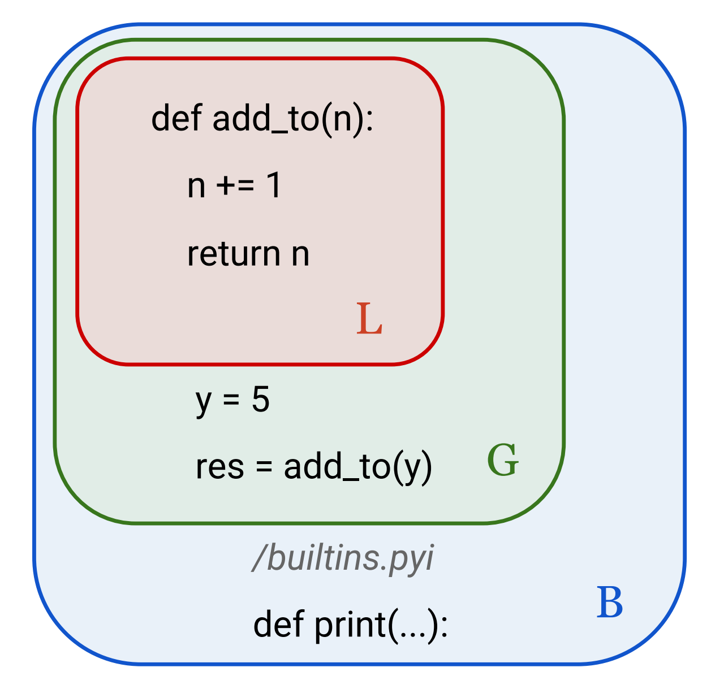

# Импорт из модулей и пакетов

## Модули и пакеты

### Создание модуля

**`Модуль` - это отдельный файл, определения и выражения внутри которого можно использовать в других файлах**.

Разберем импорт имен на примере модуля `mathematics.py`, который можно [скачать по ссылке](files/mathematics.py). Далее, добавьте скачанный модуль в ваш проект.

**Обратите внимание**, что в следующих разделах модулем будет называться файл с расширением `.py`.

Часть содержимого модуля `mathematics.py` можно также посмотреть в блоке кода ниже.

```Python
######## MODULE: mathematics ########

## Mathematics contains functions with mathematical operations are used to perform various mathematical operations,
## such as finding the roots of an equation, exponentiation, multiplication and division.
## about Sphinx documentation – https://sphinx-rtd-tutorial.readthedocs.io/en/latest/docstrings.html


def square_root(val: int) -> float:
    """
    The function returns the square root of the number.
    
    :param val: a number from an integer set
    :type val: int
    
    :return: squre root of val
    :rtype: float
    """
    return val ** .5

# и тд
```

Подробнее об используемом оформлении функций вы можете посмотреть в теме [Функции. Свойства и параметры функций](/docs/markdown/part_1/functions.md#документирование-и-аннотация-функции)

В проекте сейчас имеется два модуля:

* main.py
* mathematics.py

### Способы импорта из модуля

Самым простым способом для того, чтобы получить доступ к выражениям другого модуля (файла), является вызов оператора `import`.

В файле main.py

**Первым способом является импорт имени модуля**. Для доступа к именам функций необходимо сначала указать имя модуля, затем, после точки, указать имя функции для импорта в текущий файл. Именем модуля является имя файла без добавления суффикса `.py`.

```Python
import mathematics

print(mathematics.multiply(4, 4))
```

**Импорт с синонимом**

Возможно вы заметили, что при вызове имени, перед ним необходимо указывать модуль, откуда это имя пришло. Написание названия `mathematics` занимает значительное место. Поэтому для модуля можно определить новое короткое имя, с помощью которого можно вызывать имени модуля. **Обратите внимание, что синоним заменяет название модуля.**

```Python
import mathematics as mth

print(mth.multiply(4, 4))
```

**Прямой импорт**

Для того, чтобы полностью включить имя в текущий файл, можно включить его полностью. Такой способ импорта может быть полезен, если мы четко знаем какие функции нам могут понадобится. Будьте осторожны! Можно случайно перекрыть другое имя.

```Python
from mathematics import multiply

print(multiply(4, 4))
```

??? tip "Примеры из практики"

    === "Импорт имени модуля"
        ```Python
        import os
        import sys
        ```
    
    === "Импорт с синонином"
        ```Python
        import pandas as pd
        import numpy as np
        ```
        
    === "Импорт конкретного имени"
        ```Python
         from flask import Flask
        ```

**Импорт всех имен**

Импортировать все имена из модуля в пространство имен текущего модуля. **Редко используется из-за пересечения пространств имен.** Так как нам неизвестно, какие имена могут быть внутри модуля, присутствует риск заменить используемое имя переменной. В данном примере, функция `pow` заменила встроенную функцию `pow`

```Python
from mathematics import *

print(multiply(4, 4), divide(4, 2), pow(3, 4), square_root(16))
```

### Создание пакета

**`Пакет` — это набор модулей в каталоге, который содержит файл инициализации \_\_init__.py**

Пакет позволяет структурировать имена в большом количестве модулей. Примером пакета служит проект, генерируемый `scrapy`. Это мощный фреймворк для сбора данных из веб-ресурсов, о котором подробнее вы можете почитать [по ссылке](https://scrapy.org/).Разберем импорт имен на упрощенном примере пакета web_parser, который можно скачать в виде архива [по ссылке](files/web_parser.zip).

Предоставленный пакет содержит:

* Модули
  * Подпакеты
  * Файл \_\_init__.py
* Папки \_\_pycache__

Имена хранятся в модулях или в файле \_\_init__.py

### Способы импорта из пакета

Импорт имен из пакетов будет аналогичен импорту из модулей.

**Прямой импорт из пакета**

Перейдите в файл app.py. Теперь запишем импорт имен из пакета web_parser. Для импорта необходимо указать пакет, в котором находится модуль, из которого импортируется имя. К сожалению, запись вызова будет довольно объемной.

```Python
import web_parser.middlewares

print(web_parser.middlewares.from_crawler())
```

**Импорт с синонимом**

Так как написание названия пакета и модуля занимает значительное место. Поэтому, также как и для модуля, для пакета можно определить новое короткое имя, с помощью которого можно вызывать имени модуля. Заметьте, что синоним заменяет название пакета.

```Python
import web_parser.middlewares as mw

print(mw.from_crawler())
```

!!! tip "Примеры из практики"

    Импорт с синонином

    ```Python
    import matplotlib.pyplot as plt
    ```

**Импорт из \_\_init__.py**

Зачастую, файл \_\_init__.py пуст. Однако, если в нем разместить импорты или какие-либо имена, то вызвать их можно просто сославшись на пакет. Например, если импортировать подпакет `web_parser.spiders`, то будет доступно имя `spider`, даже если мы **не ссылаемся на модуль** `web_parser`.

```Python
import web_parser.spiders as sp

print(sp.spider())
```

??? tip "Точка перед именем пакета"

    В том случае, если необходимо произвести импорт из текущего каталога, то необходимо указать откуда начинать поиск по каталогам. С помощью символа «.» можно указать, что поиск модуля нужно производить с текущей позиции. Если модуль находится на уровень выше, то можно указать символы «..»

    ```Python
    ## в текущем каталоге
    from .web_spider import spider
    ## в предыдущем каталоге
    from ..settings import FEED_EXPORT_ENCODING
    ```

## Структура модуля

Для того, чтобы модуль функционировал корректно, необходимо соблюдать ряд рекомендация при его формировании.

1. Импорты (import os)
2. Константы (PATH='C:\Users\’)
3. Функции (def func(par):)
4. Классы (class Person:) – тема ООП
5. Тело цикла-условия

```Python
###### Структура модуля

#### 1. Подключить модули
from mathematics import multiply


#### 2. Константы
PI = 3.1415926 


#### 3. Создание функций
## Длина окружности
def Circumference(r):
    return 2*PI*r

## Площадь окружности
def AreaCircle(r):
    return PI*r*r

## Объем шара
def VolumeSphere(r):
    return 4.0/3.0*PI*r*r*r


#### 4. Вычисления/запуск/тело цикла-условия
if __name__ == '__main__':

    ## Вычислить длину окружности
    Length = Circumference(6)
    
    print("Length = ", Length)
       
    ## Вычислить площадь окружности
    Area = AreaCircle(6)
    print("Area = ", Area)
```

??? tip "Для чего нужно условие if \_\_name__ == '\_\_main__'?"

    Ранее было использовано условие с необычным именем `__name__`. Каждый модуль, как и любой другой объект в python имеет свое имя. Если импортировать модуль `mathematics` и вызвать его имя `__name__`, то получим название файла. Однако, при вызове имени запускаемого модуля app, получаем `__main__`. Значит, если модуль называется `__main__`, то он является исполняемым.

    Проверим

    ```Python
    import mathematics as mth

    print(__name__) # __main__
    print(mth.__name__) # mathematics
    ```

    Подобный принцип формирования скрипта можно увидеть в проектах довольно часто. С помощью конструкции if `__name__ == ‘__main__’` определяют файл, который является стартом для всего проекта. Например, таким образом можно запускать веб приложение или ботов.

## Пространство имен

### Уровни пространства имен

**`Пространство имен` — это совокупность имен с информацией об объекте, которые разделены по уровням.** Python формирует имена в словарь, в котором ключи — это имена, а значения — сами объекты. Для организации имен в пространствах используется `namespace` — структура, используемая для организации имен объектов в Python.


**Уровни пространств имен**

При работе с модулем выделяют несколько пространств (scopes), имена в которых не пересекаются:
* `local` — локальные имена существуют внутри функции.
* `global` — глобальные имена модуля существуют на уровне файла.
* `__builtins__` — набор встроенных имен доступны в любое время, когда запущен Python.



**Порядок проверки scope-ов**

Существование нескольких scope-ов означает, что несколько разных экземпляров определенного имени могут существовать одновременно. 

1. Сначала Python ищет в локальной области видимости `L`.
2. Eсли нет результатов, то интерпретатор затем просматривает глобальную область видимости `G`.
3. Если Python не может найти переменную нигде больше, то поиск идет по встроенной области видимости `B`.

### Поиск переменной var

Согласно проверке переменная `var` находится в трех областях Можно осуществить последовательный вывод на экран. Переменной `no_name` нет ни в одной из областей.

```Python
var = 'глобальная'
def func():
    var = 'вложенная'
    print('var в func =', var)
    def _inside():
        var = 'локальная'
        print('var в _inside =', var)
    _inside()

func()
print('var =', var)
# print(no_name)
```

**Словари пространств имен**

Имена в scope-ах хранятся в виде словарей. Например при вызове функции `globals()` можно получить текущий словарь глобального пространства имен. Аналогично, `locals()`. Объявление оператора `global` позволяет функции получать доступ к объекту в глобальной области видимости. Имена, указанные после оператора `nonlocal`, ссылаются на переменные в предыдущей области.

```Python
fvar = 'из модуля'

def func():
    global fvar # станет глобальной
    fvar = 'из функции'
    svar = 'из функции'
    def _inside():
        nonlocal svar # заменит внешнее имя
        svar = 'из функции-оболочки'
    _inside()
    print('svar =', svar)

func()
print('fvar =', fvar)
```

??? abstract "Про скорость Python"

    

    Рассмотрим процесс запуска модулей

    ```mermaid
    graph LR
        A[Исходный код <br> file.py] --> B[Байт-код <br> file.cpython-310.pyc]
        B --> C[Выполнение на <br>PVM]
    ```

    * Интерпретатор – программа, которая последовательно выполняет инструкции в файле.
    * Компилятор – программа, которая переводит написанные команды в байт-код
    * Байт-код – это низкоуровневое представление исходного кода программы вне зависимости от платформы. 
    Инструкции в байт-коде выполняются значительно быстрее.
    * Python virtual machine – часть пакета при установке Python, которая исполняет байт-код после компиляции из 
    исходного кода

    ==Почему считают, что Python медленный?==
    
    * Байт-код не является двоичным, следовательно, в 
    отличии от C, не может выполняться напрямую 
    процессором.
    * Для ускорения запуска программы интерпретатор 
    предкомпилирует модули.
    * Для этого создается каталог `__pycache__`, в котором 
    хранится бинарный код python с расширением `.pyc`.
    * Если в модуль внести изменения, то фиксируется время, 
    когда он был изменен. При несоответствии исходного и 
    нового времени изменения (версии) pyc-файл 
    перекомпилируется.

??? tip "Что такое "disassambler"?"
    
    Модуль `dis` позволяет использовать одноименную функцию для того, чтобы конвертировать функцию в код ассемблера, то есть разобрать код на этапы выполнения. [Ассемблер](https://ru.wikipedia.org/wiki/%D0%90%D1%81%D1%81%D0%B5%D0%BC%D0%B1%D0%BB%D0%B5%D1%80) — это язык программирования, который позволяет писать программы на низком уровне, то есть он оперирует инструкциями, которые процессор выполняет непосредственно. Низкоуровневые языки могут использоваться для оптимизации программ и повышения их производительности.

    ```Python
    from dis import dis

    def func(param):
        x = 10
        return param == x
    
    dis(func)
    ```
## Промежуточные итоги

* Модули – это файлы, представленные в Python как объекты. У них также есть свои свойства.
* Для организации пространства скриптов, имена можно организовывать в отдельные модули и импортировать их из них.
* Из модулей формируются пакеты, которые можно инициализировать для удобства импорта.
* Имена могут пересекаться в зависимости от того пространства, в котором они находятся.
* Функции можно «разбирать» на составные части –
дисассемблировать.
